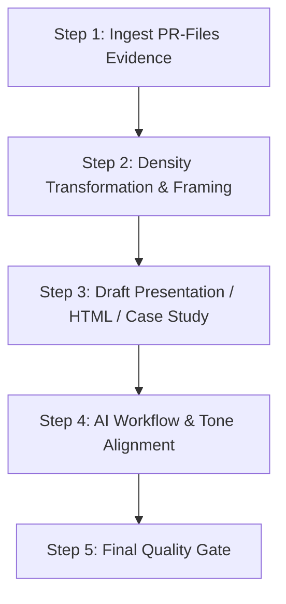

# Portfolio Document Skill (`portfolio-document`)

## 1. Goal & Positioning
본 스킬은 `PR-Files/`에 축적된 검증된 엔지니어링 증거(Evidence)만을 기반으로, 면접관과 평가자가 빠르고 깊이 있게 이해할 수 있는 **대외용 포트폴리오 산출물(`PRD-PO/`)을 가공·생산**하는 전용 스킬입니다.

### 🎯 핵심 포지셔닝 메시지
> **"단순히 코드를 작성하는 개발자가 아니라, 프레임워크의 원리를 이해하고, 백엔드 시스템을 설계하고, 컨테이너 환경에서 실행하고, 테스트와 관측을 통해 검증하고, 장애를 분석하며, AI Agent를 개발 프로세스에 통합하는 엔지니어"**

> [!CRITICAL]
> **엄격한 데이터 흐름 제약 (Strict Read-Only Dependency):**
> - 본 스킬은 **`PR-Files/`의 검증된 정보만을 소비(Read-Only)**합니다.
> - 원본 저장소(`26-05adf`, `SA-1`)를 직접 추측하거나 `PR-Files`에 없는 내용을 임의로 지어내지 않습니다.
> - 미구현/미검증 기술(N+1 벤치마크 실측, MQ 등)은 반드시 `[PLANNED]` 또는 Roadmap으로만 다루며 구현 완료로 포장하지 않습니다.
> - **AI 활용 서술 원칙:** "AI가 개발했다"가 아닌 **"통제된 개발 프로세스(Context Reading ➔ Planning ➔ Agent Delegation ➔ Human Review ➔ Verification)의 생산성 도구로 AI Agent를 활용했다"**로 기술합니다.

---

## 2. Deliverable Types & Responsibilities

`PRD-PO/` 하위 3대 산출물의 역할과 정보 밀도 차이는 다음과 같습니다:

```text
[ Presentation (슬라이드) ] ───> 빠른 발표/스캐닝 최적화 (12~15p, 1슬라이드 1핵심메시지, 시각화 위주)
[ Web Portfolio (HTML) ]    ───> 상세 기술 설명 & 인터랙티브 Evidence 탐색 (Mermaid, 메트릭, 증거 링크)
[ Case Study (사례 연구) ]   ───> 심층 기술 면접 대비 8단계 문제 해결 서사 (Decision & Trade-off 중심)
```

---

## 3. Production Standards for Deliverables

### (1) Presentation Deck (12~15 Pages Blueprint)
- **분량:** 12~15페이지 (근거 없는 내용은 억지로 채우지 않고 축소 가능).
- **원칙:** 1페이지 1핵심 메시지, 3~5분 발표 스캐닝 최적화.
- **슬라이드 표준 포맷:**
  ```markdown
  ## Slide [XX]: [슬라이드 제목] - [1개 핵심 테제]

  ### 1. Problem & Challenge (직면한 문제)
  - 해결하고자 한 구체적 엔지니어링 난제

  ### 2. Technical Decision & Architecture (의사결정 및 구현)
  - 기술적 선택 배경 및 핵심 구조 (다이어그램 / 핵심 스니펫)

  ### 3. Verification & Result (검증 및 실측 성과)
  - 실측 수치 (k6 70 VU, 5.64ms, 0% Error 등 사실만 인용)

  ### 4. Evidence Link (증거 참조)
  - `PR-Files/...` 해당 명세 문서 링크

  ---
  > 🎙️ **Speaker Note (발표 스크립트):**
  > (발표자가 30초~1분 내외로 설명할 구술 스크립트)
  ```

- **권장 슬라이드 흐름:**
  `01 Overview` ➔ `02 Problem/Goal` ➔ `03 System Topology` ➔ `04 Backend Arch` ➔ `05 Auth (JWT/Redis)` ➔ `06 Authz (RBAC)` ➔ `07 DB Migration` ➔ `08 Docker/Nginx` ➔ `09 Testing/Security` ➔ `10 Perf (k6)` ➔ `11 Troubleshooting` ➔ `12 AI Workflow` ➔ `13 Engineering Process` ➔ `14 Limitations & Roadmap` ➔ `15 Closing`

---

### (2) Web Portfolio (HTML / Markdown Web Layout)
- **원칙:** PPT를 단순 복사하지 않고, 웹에서 풍부한 기술적 깊이와 Evidence를 탐색할 수 있도록 확장.
- **포함 요소:**
  - Mermaid 기반 인터랙티브 시스템 및 보안 플로우차트
  - k6 실측 성능 지표 대시보드 테이블
  - TS-01 장애 복원 타임라인
  - `PR-Files/` 원천 증거 문서로의 상세 하이퍼링크

---

### (3) Deep Case Study (8-Step Standard Structure)
심층 기술 난제 해결 문서는 반드시 다음 8단계를 준수합니다:
```markdown
# [CS-XX] [케이스 스터디 제목]

1. Problem (문제 상황): 직면한 한계 또는 장애 증상
2. Context (배경 맥락): 아키텍처 환경 및 시스템 제약 조건
3. Decision (기술적 의사결정): 대안 비교 및 최종 선택 이유 (Trade-off 분석)
4. Implementation (구현): 실제 적용된 핵심 코드/설정 변경점
5. Verification (검증): 통과된 테스트 케이스 및 부하 테스트 실측 지표
6. Result (결과 및 효과): 수치적/안정성 개선 결과
7. Limitation (한계점): 현재 아키텍처의 트레이드오프 및 미해결 영역
8. Next Step (향후 계획): Roadmap에 반영된 개선 과제
```

---

## 4. Operational Workflow



### Step 1: Ingest PR-Files Evidence
- `PR-Files/` 내의 해당 도메인 명세 및 `SOURCE_OF_TRUTH_SNAPSHOT.md`를 필수로 먼저 읽습니다.

### Step 2: Density Transformation & Framing
- 엔지니어링 명세를 포트폴리오 산출물 목적(슬라이드 압축, 웹 인터랙션, 8단계 서사)에 맞춰 정보 밀도를 재조정합니다.

### Step 3: Draft Deliverables
- 표준 포맷에 맞춰 각 문서를 작성합니다.

### Step 4: AI Workflow & Tone Alignment
- AI 개발 프로세스를 기술할 때 개발자 통제 하의 워크플로우로 일관되게 표현되었는지 점검합니다.

### Step 5: Final Quality Gate
- [ ] `PR-Files`에 없는 내용을 임의로 창작하지 않았는가?
- [ ] k6 수치(70 VU, 5.64ms, 463 req/s 등)가 불변 팩트와 정확히 일치하는가?
- [ ] 미구현 항목이 `[PLANNED]` / Roadmap으로 격리되어 있는가?
- [ ] 슬라이드가 12~15페이지 범위 및 1페이지 1메시지를 지키고 있는가?
- [ ] HTML이 PPT의 단순 복사본이 아닌 상세 Evidence 탐색 구조를 갖추었는가?
- [ ] Case Study가 8단계 표준 구조를 준수하는가?