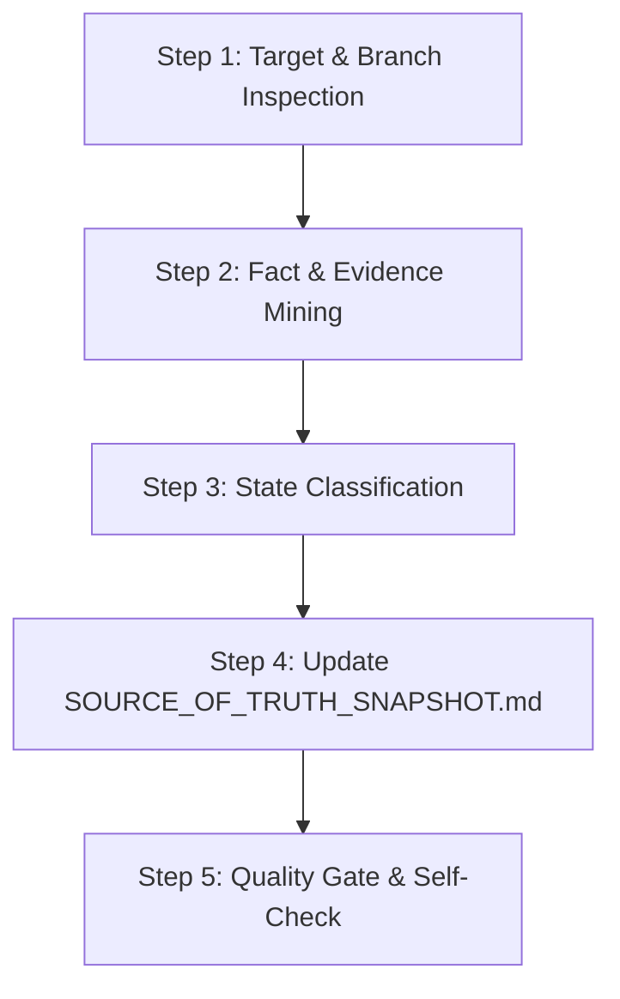

# Source Verification Skill (`source-verification`)

## 1. Goal & Identity
본 스킬은 **단일 진실 공급원(Source of Truth)**인 원본 저장소들의 실제 코드, 설정, 테스트 결과, 문서를 직접 확인하여 **오직 검증된 사실(Fact Base)만을 추출하고 추적성을 확보**하는 전용 스킬입니다.

> [!CRITICAL]
> **책임 경계 (Strict Boundary):**
> - 본 스킬은 **사실 검증 및 `SOURCE_OF_TRUTH_SNAPSHOT.md` 관리 전용**입니다.
> - 본 스킬에서는 PPT, HTML, Case Study 등 포트폴리오 문서를 절대 작성하지 않습니다.
> - 원본 저장소 코드를 불필요하게 복제하지 않고, 파일 경로와 라인, 실측 수치만을 추출합니다.

---

## 2. Source of Truth Targets & Fixed Branches

| 구분 | 저장소 URL | 고정 Branch | 주요 검증 대상 |
| :--- | :--- | :--- | :--- |
| **Primary Source 1** (Application) | `https://github.com/bluejals13/26-05adf` | `feature/auth@0603@1401` | Spring Boot 3.3, Security 6, JWT/Redis RTR, Flyway, k6 부하테스트, Docker, Nginx, Prometheus |
| **Primary Source 2** (AI / Process) | `https://github.com/bluejals13/SA-1` | `main` | AI-Assisted Engineering Workflow, 프롬프트 규약, 문서화 5대 원칙, Changelog |
| **Processing Workspace** | `https://github.com/bluejals13/PR-1A1` | 현재 작업 디렉터리 | 기술 명세 가공 및 포트폴리오 산출물 저장소 |

---

## 3. Strict Verification & State Classification Protocol

어떠한 경우에도 추측, 일반적 Spring 지식, 이전 대화 내용으로 사실을 채우지 않습니다. 모든 항목은 반드시 다음 5대 상태 태그 중 하나로 판정합니다.

```
[ 판정 프로토콜 ]
1. 소스 코드(.java, .sql, .yml 등)에 파일 및 로직이 실제로 존재하는가?
   ├─ No ──> [UNKNOWN] (추측 금지, 포트폴리오 인용 절대 불가)
   └─ Yes ──> 2. 실제 테스트 코드(JUnit, k6) 또는 실행 로그로 검증되었는가?
               ├─ No ──> [IMPLEMENTED] (코드는 존재하나 검증 근거 미확인)
               └─ Yes ──> [VERIFIED] (테스트 통과 및 실측 수치 확보 완료)

3. 아키텍처, 컨벤션, 장애 보고서 등 공식 기술 문서에 명시되어 있는가?
   └─ Yes ──> [DOCUMENTED]

4. 향후 로드맵 또는 미완료 작업(task_progress.md 미완료 등)으로 계획된 항목인가?
   └─ Yes ──> [PLANNED] (절대 구현 완료로 포장 금지, Roadmap 명시)
```

---

## 4. Operational Workflow



### Step 1: Target & Branch Inspection
- 검증 대상 저장소와 브랜치 일치 여부를 재확인합니다 (`26-05adf`의 `feature/auth@0603@1401`, `SA-1`의 `main`).
- 다른 브랜치나 임의의 외부 저장소 데이터를 섞지 않습니다.

### Step 2: Fact & Evidence Mining
- **Backend/Security:** JWT 만료 시간, Refresh Token 저장소(Redis), RTR 구현 여부, Blacklist 로직, RBAC 엔티티 및 Security Filter 검증.
- **Performance:** k6 스크립트(`load.test.js` 등) 및 실측 리포트 수치(70 VUs, 5.64ms, 463 req/s, 0.00% error) 확인.
- **Infra/Docker:** Docker Compose 포트 매핑(80, 8080, 3306, 6379, 9090, 8428, 3000), Nginx 리버스 프록시 설정 확인.
- **Troubleshooting:** 실제 발생했던 장애(TS-01 Redis 타임아웃 등)의 원인과 패치 코드 확인.
- **AI Workflow:** SA-1의 Zero-Chatter, Documentation-First 규칙 및 8단계 AI 라이프사이클 확인.

### Step 3: State Classification
- 수집된 모든 기능과 지표에 `[IMPLEMENTED]`, `[VERIFIED]`, `[DOCUMENTED]`, `[PLANNED]`, `[UNKNOWN]` 태그를 엄격히 부여합니다.

### Step 4: Snapshot Generation & Update
- `PR-Files/evidence/SOURCE_OF_TRUTH_SNAPSHOT.md`를 갱신합니다.
- Claim-to-Evidence Matrix를 작성하여 각 항목별 소스 파일명과 테스트 파일명을 매핑합니다:
  ```text
  [Claim] -> [Source Repo & Branch] -> [Implementation File:Line] -> [Test/Log Verification] -> [Result]
  ```

### Step 5: Quality Gate & Self-Check
- [ ] 원본 브랜치가 정확히 `feature/auth@0603@1401` 및 `main`인가?
- [ ] k6 수치 등 모든 수치가 창작되지 않고 실측치와 100% 일치하는가?
- [ ] 미구현 항목(N+1 벤치마크, MQ 등)이 `[PLANNED]`로 올바르게 격리되었는가?
- [ ] 원본 코드를 불필요하게 통째로 복사하지 않았는가?