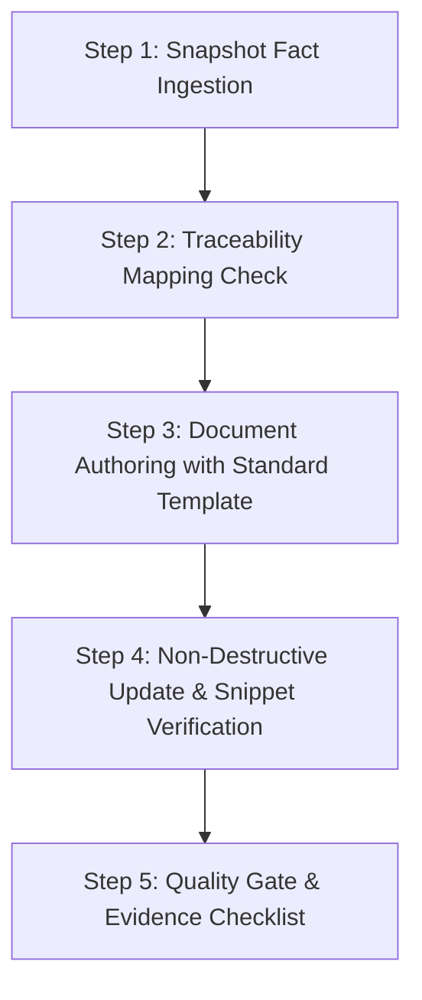

# Verification Document Skill (`verification-document`)

## 1. Goal & Identity
본 스킬은 `PR-Files/` 디렉터리 내에 **엔지니어링 수준의 기술 명세(Specification), 검증 명세(Verification), 성능 실측 보고서(Performance), 장애 분석서(Troubleshooting), AI 프로세스 명세(AI-Workflow)**를 작성하는 전용 스킬입니다.

> [!CRITICAL]
> **핵심 원칙 (Engineering Evidence First):**
> - 본 스킬은 대외 면접용 미사여구를 작성하는 곳이 아닙니다.
> - 다른 엔지니어가 읽었을 때 **"이 주장이 실제 코드 어디에 있는가?", "어떤 테스트로 검증되었는가?", "어떤 설정으로 동작하는가?"**를 완벽하게 입증할 수 있어야 합니다.
> - 반드시 `SOURCE_OF_TRUTH_SNAPSHOT.md`의 사실을 기반으로 작성하며, 원본 코드를 통째로 복제하지 않고 **핵심 발췌 스니펫 및 파일/라인 매핑**을 사용합니다.

---

## 2. Directory Responsibility & Domain Mapping

`PR-Files/` 하위 6대 영역별 작성 책임과 산출물 규격은 다음과 같습니다:

| 도메인 디렉터리 | 담당 영역 및 작성 내용 | 필수 포함 요소 |
| :--- | :--- | :--- |
| **`architecture/`** | 시스템 토폴로지, Nginx 단일 진입점, 포트 격리, 컨테이너 아키텍처 | Mermaid 아키텍처 다이어그램, 포트 매핑표, 네트워크 격리 정책 |
| **`specification/`** | JWT 수명주기, RTR(Refresh Token Rotation), Blacklist, RBAC 권한 매트릭스, DB 스키마 | 엔티티/테이블 매핑, DTO/Response 규격, Flyway 마이그레이션 이력 |
| **`verification/`** | JUnit 단위/통합 보안 테스트 스위트 매핑, 인가 거부 시나리오 | 테스트 클래스명, 검증 시나리오 목록, 통과 증거(Assertion) |
| **`performance/`** | k6 부하 테스트 실측 보고서, 메트릭 분석, 임계치(Threshold) 판정 | 실측 불변치(70 VU, 5.64ms, 463 req/s, 0.00% error), k6 스크립트 매핑 |
| **`troubleshooting/`** | 장애 및 병목 원인 분석, 패치 내역, 재발 방지 대책 (TS 표준) | **TS 6단계 표준 구조 필수 준수** (Symptom ➔ Impact ➔ Diagnosis ➔ Root Cause ➔ Resolution ➔ Prevention) |
| **`ai-workflow/`** | SA-1 기반 AI-Assisted Engineering Workflow, 커맨드 규격, 변경 통제 | Documentation-First 규칙, Zero-Chatter 규칙, 8단계 개발 사이클 |

---

## 3. Standard Document Formats

### Format A: Technical & Verification Specification
```markdown
# [문서 제목]

## 1. 개요 및 설계 목적
- 목적 및 해결 과제 정의
- 상태 분류 태그: `[IMPLEMENTED]` / `[VERIFIED]` / `[DOCUMENTED]` / `[PLANNED]`

## 2. Source of Truth 매핑
- 소스 코드: `backend/src/main/.../AuthService.java`
- 테스트 코드: `backend/src/test/.../SecurityIntegrationTest.java`
- 설정 파일: `backend/src/main/resources/application.yml`

## 3. 핵심 아키텍처 및 메커니즘
- 메커니즘 설명 및 Mermaid 흐름도
- 핵심 로직 스니펫 (전체 복제 금지, 핵심 10~30줄만 발췌)

## 4. 검증 결과 및 증거 (Evidence)
- 테스트 케이스 및 검증된 동작
- 실측 지표 또는 동작 로그
```

### Format B: 6-Step Standard Troubleshooting Document
```markdown
# [TS-XX] [장애 요약 제목]

- **Status:** `[VERIFIED]` `[DOCUMENTED]`
- **Related Source:** `26-05adf` (`feature/auth@0603@1401`)

## 1. Symptom (현상)
- 발생한 오류 현상 및 외적 증상

## 2. Impact (영향 범위)
- 심각도 (Critical / High / Medium / Low) 및 시스템 영향도

## 3. Diagnosis (진단 및 재현)
- 탐지 방법 및 서버 에러 로그

## 4. Root Cause (근본 원인)
- 기술적 근본 원인 분석

## 5. Resolution (해결 방법)
- 실제 코드/설정 변경 내역 (Diff 형태 또는 스니펫)

## 6. Prevention (재발 방지 대책)
- 타임아웃 방어, 테스트 케이스 추가, 모니터링 경보
```

---

## 4. Operational Workflow



### Step 1: Snapshot Fact Ingestion
- `PR-Files/evidence/SOURCE_OF_TRUTH_SNAPSHOT.md`를 읽고 검증된 팩트와 상태 태그를 확인합니다.
- 스냅샷에 없는 사실을 임의로 작성하려 하지 않습니다.

### Step 2: Traceability Mapping Check
- 작성하려는 주장이 소스 파일, 라인 번호, 테스트 스위트와 연결되는지 사전에 검토합니다.

### Step 3: Document Authoring with Standard Template
- 대상 도메인에 맞는 표준 템플릿(Format A 또는 B)을 적용하여 마크다운 문서를 작성합니다.
- 모든 섹션에 `[IMPLEMENTED]`, `[VERIFIED]` 등 상태 태그를 명시합니다.

### Step 4: Non-Destructive Update
- 기존 작성된 README 및 상위 문서를 파괴하지 않고, 하위 명세 문서를 점진적으로 추가/보강합니다.

### Step 5: Quality Gate Checklist
- [ ] 사실 근거가 명확하며 추측된 내용이 없는가?
- [ ] 소스 파일 및 테스트 파일 매핑 경로가 정확한가?
- [ ] k6 수치(70 VU, 5.64ms, 463 req/s 등)가 불변 팩트와 일치하는가?
- [ ] 장애 분석 문서가 6단계 표준(Symptom~Prevention)을 엄격히 준수하는가?
- [ ] 원본 소스 코드를 통째로 복사하지 않고 핵심 로직 위주로 발췌했는가?