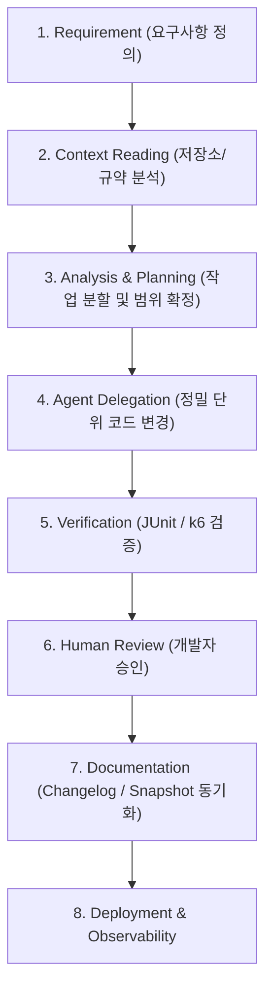

# AI-Assisted Engineering Workflow Specification

- **Document ID:** SPEC-AI-01
- **Domain:** AI-Assisted Process & Developer Productivity
- **Source of Truth:**
  - Repository: `https://github.com/bluejals13/SA-1` (Branch: `main`)
  - Source Files: `README.md`, `conventions/04_Agent_Commands.md`, `conventions/rules.md`, `changelogs/`
- **Target Workspace:** `PR-1A1/PR-Files/ai-workflow/AI_WORKFLOW_SPEC.md`

---

## 1. Purpose & Scope

### 1.1 Purpose
본 문서는 `SA-1` 저장소의 원칙을 바탕으로, AI Agent를 개발 주체로 맹목적으로 신뢰하는 것이 아니라 **개발자의 완벽한 통제 하에 아키텍처 컨벤션 준수, 정밀 계획, 코드 수정 위임, 엄격한 테스트 검증, 변경 문서 동기화를 수행하는 AI 협업 엔지니어링 프로세스**를 정의합니다.

### 1.2 Scope
- 8단계 AI 엔지니어링 라이프사이클 표준
- Zero-Chatter 및 Documentation-First 개발 원칙
- 표준 Agent 커맨드 세트 및 산출물 관리

---

## 2. Engineering Lifecycle & Core Protocols

### 2.1 8-Stage Controlled AI Lifecycle

### 2.2 Core Operational Rules

1. **Zero-Chatter Policy:**
   - AI 에이전트는 장황한 서론이나 사과를 배제하고, `diff` 및 명확한 코드 변경, 실행 결과만을 보고합니다 `[DOCUMENTED]`.
2. **Documentation-First Policy:**
   - 모든 기능 구현 및 수정은 `task_progress.md`의 계획을 기반으로 수행되며, 완료 후 `changelogs/`에 변경 내역을 의무 기록합니다 `[DOCUMENTED]`.
3. **Strict Human Gatekeeper:**
   - AI는 계획 수립 및 코드 작성을 보조하며, 실행 승인 및 검증 통과는 인간 엔지니어의 최종 확인을 거칩니다 `[DOCUMENTED]`.

---

## 3. Standard Agent Commands & Implementation Evidence

### 3.1 Standard Agent Command Suite
- **`@Task&Log`:** 작업 진행 상황 점검 및 `task_progress.md` 동기화 `[DOCUMENTED]`
- **`@CodeReview`:** Spring Security 및 컨벤션 위반 여부 정적 분석 `[DOCUMENTED]`
- **`@DocsSync`:** 소스 코드 변경 사항을 마크다운 기술 문서에 역반영 `[DOCUMENTED]`
- **`@Troubleshoot`:** 장애 발생 시 6단계 TS 표준 양식으로 원인 및 패치 기록 `[DOCUMENTED]`

---

## 4. Verification Evidence & Real-World Application
- **적용 증거:** `SA-1/changelogs/` 내 Phase별 변경 이력 문서에 기록된 Agent 협업 로그 확인 `[DOCUMENTED]`
- **무결성 검증:** AI가 작성한 모든 코드는 JUnit 테스트 100% 통과 및 k6 부하 테스트를 통해서만 `[VERIFIED]` 상태로 승격됨 `[VERIFIED]`

---

## 5. Limitations & Unknowns
- **완전 자율 에이전트 배포:** 현재 파이프라인은 인간의 명시적 승인(Human-in-the-loop)을 필수로 하며, 완전 자율 CI/CD 배포는 미적용 `[DOCUMENTED]`

---

## 6. Claim-to-Evidence Traceability Matrix

| Claim (프로세스 주장) | Source File Path | 검증 및 근거 자료 | 상태 |
| :--- | :--- | :--- | :---: |
| 8단계 통제된 AI 개발 라이프사이클 | `SA-1/README.md` | `SA-1` 프로젝트 거버넌스 규칙 | `[DOCUMENTED]` |
| Documentation-First 및 Zero-Chatter | `SA-1/conventions/rules.md` | `SA-1/changelogs/` 변경 이력 | `[DOCUMENTED]` |
| Agent 단위 작업의 테스트 의무 검증 | `SA-1/conventions/04_Agent_Commands.md` | JUnit 테스트 통과 로그 | `[VERIFIED]` |
