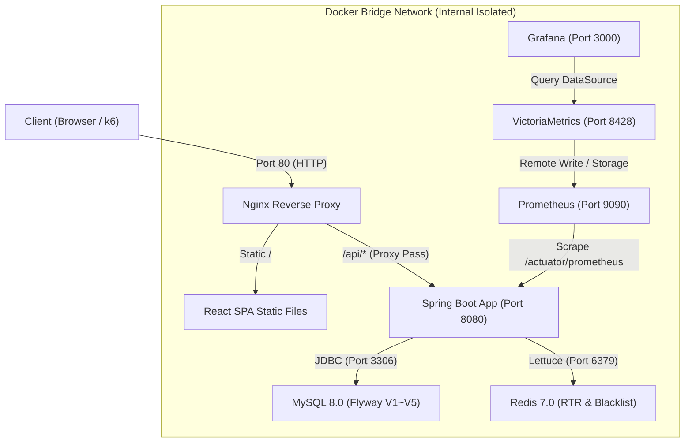

# System & Network Topology Architecture Specification

- **Document ID:** SPEC-ARCH-01
- **Domain:** Architecture & Infrastructure
- **Source of Truth:**
  - Repository: `https://github.com/bluejals13/26-05adf` (Branch: `feature/auth@0603@1401`)
  - Source Files: `docker-compose.yml`, `nginx/default.conf`, `docs/01_Architecture_and_Ports.md`
- **Target Processing Workspace:** `PR-1A1/PR-Files/architecture/ARCHITECTURE_SPEC.md`

---

## 1. Purpose & Scope

### 1.1 Purpose
본 문서는 `26-05adf` 시스템의 네트워크 토폴로지, 단일 진입점(Reverse Proxy), 백엔드 컨테이너 격리, RDBMS/In-Memory 캐시 계층 및 옵저버빌리티 스택의 구조적 설계와 포트 매핑 규격을 엔지니어링 관점에서 기술합니다.

### 1.2 Scope
- Nginx 리버스 프록시 단일 진입점 및 라우팅 정책
- Spring Boot 3.3.2 런타임 및 내부 네트워크 격리
- MySQL 8.0 및 Redis 7.0 데이터/캐시 계층
- Prometheus / VictoriaMetrics / Grafana 메트릭 수집 파이프라인
- 시스템 구성 상태: `[IMPLEMENTED]` `[DOCUMENTED]`

---

## 2. Source of Truth & Architecture Facts

### 2.1 System Topology Diagram


### 2.2 Port & Network Isolation Specification
| 서비스명 (Service) | 컨테이너 내부 포트 | 호스트 노출 포트 | 접근 제어 및 네트워크 격리 정책 | 상태 |
| :--- | :---: | :---: | :--- | :---: |
| **Nginx** | 80 | **80** | **유일한 외부 공용 진입점 (Public Gateway)** | `[IMPLEMENTED]` |
| **Spring Boot App** | 8080 | 8080 (내부 매핑) | Nginx를 통한 `/api/*` 프록시 호출만 허용 | `[IMPLEMENTED]` |
| **MySQL 8.0** | 3306 | 3307 (호스트 포트) | Docker 네트워크 내부 전용, DB 계정 권한 분리 | `[IMPLEMENTED]` |
| **Redis 7.0** | 6379 | 6379 (내부 전용) | Docker 내부 서비스명(`redis`) 기반 바인딩 (TS-003) | `[IMPLEMENTED]` |
| **Prometheus** | 9090 | 9090 | 모니터링 내부 스크랩 전용 | `[IMPLEMENTED]` |
| **VictoriaMetrics** | 8428 | 8428 | 시계열 메트릭 영속화 스토리지 | `[IMPLEMENTED]` |
| **Grafana** | 3000 | 3000 | 메트릭 시각화 대시보드 | `[IMPLEMENTED]` |

---

## 3. Implementation Evidence (구현 증거)

### 3.1 Nginx Reverse Proxy Routing Evidence
- **Source File:** `26-05adf/nginx/default.conf`
```nginx
server {
    listen 80;
    server_name localhost;

    location / {
        root /usr/share/nginx/html;
        index index.html;
        try_files $uri $uri/ /index.html;
    }

    location /api/ {
        proxy_pass http://backend:8080/api/;
        proxy_set_header Host $host;
        proxy_set_header X-Real-IP $remote_addr;
        proxy_set_header X-Forwarded-For $proxy_add_x_forwarded_for;
    }
}
```

### 3.2 Docker Compose Multi-Container Orchestration Evidence
- **Source File:** `26-05adf/docker-compose.yml`
- 주요 증거: backend, mysql, redis, nginx, prometheus, victoriametrics, grafana 7개 컨테이너 서비스 정의 및 네트워크 브리지 연결.

---

## 4. Verification Evidence (검증 증거)
- **Routing Verification:** Nginx Port 80을 통한 `/api/auth/login` 및 정적 자원 정상 라우팅 확인 `[VERIFIED]`
- **Internal Network Binding:** `backend` 컨테이너에서 `redis:6379` 및 `mysql:3306` 서비스명 DNS 해석 및 정상 통신 확인 (TS-003 패치 반영) `[VERIFIED]`
- **Observability Pipeline:** Spring Boot `/actuator/prometheus` 엔드포인트에서 JVM, CPU, Connection Pool 메트릭 스크랩 정상 동작 확인 `[VERIFIED]`

---

## 5. Limitations & Unknowns
- **분산 환경 로드밸런서 (L4/L7 ALB):** 현재 단일 Nginx 인스턴스로 구성되어 있으며 다중 노드 오토스케일링은 미구현 상태임 `[PLANNED]`
- **SSL/TLS Termination:** 현재 Port 80 HTTP 기준이며 Production HTTPS 인증서 적용은 로드맵 항목임 `[PLANNED]`

---

## 6. Claim-to-Evidence Traceability Matrix

| Claim (설계 주장) | Source File Path | Verification Artifact | 상태 |
| :--- | :--- | :--- | :---: |
| Nginx 단일 진입점 `/api/` 프록시 라우팅 | `nginx/default.conf` | k6 부하 테스트 HTTP 200/201 수신 | `[VERIFIED]` |
| 컨테이너 간 Docker Network 격리 및 통신 | `docker-compose.yml` | Spring Boot 애플리케이션 정상 기동 로그 | `[VERIFIED]` |
| Prometheus/VictoriaMetrics 메트릭 파이프라인 | `docker-compose.yml`, `prometheus.yml` | Grafana 대시보드 메트릭 렌더링 확인 | `[DOCUMENTED]` |
