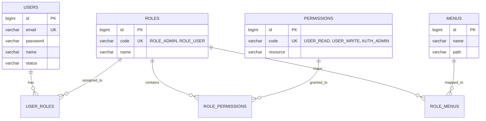

# Authentication & Security Technical Specification

- **Document ID:** SPEC-SEC-01
- **Domain:** Security, Authentication, RBAC & API Spec
- **Source of Truth:**
  - Repository: `https://github.com/bluejals13/26-05adf` (Branch: `feature/auth@0603@1401`)
  - Source Files: `backend/src/main/java/com/example/demo/auth/`, `backend/src/main/java/com/example/demo/iam/`, `backend/src/main/resources/db/migration/`
- **Target Workspace:** `PR-1A1/PR-Files/specification/AUTH_AND_SECURITY_SPEC.md`

---

## 1. Purpose & Scope

### 1.1 Purpose
본 문서는 `26-05adf`의 Stateless JWT 인증, Refresh Token Rotation(RTR), Redis 기반 토큰 블랙리스트, M:N 구조의 RBAC(Role-Based Access Control) 권한 인가 체계, 그리고 DB 마이그레이션 스키마의 기술적 세부사항을 정의합니다.

### 1.2 Scope
- JWT Access Token (1h) 및 Refresh Token (7d, RTR, UUID JTI) 메커니즘
- Redis TTL 기반 즉시 로그아웃 블랙리스트 관리
- User-Role-Permission M:N 다대다 권한 모델 및 Spring Security Filter 연계
- Flyway V1~V5 스키마 형상 관리 및 통일 API 응답 규격

---

## 2. Technical Facts & Specification

### 2.1 Token Lifecycle & Storage Policy
```text
[ Token Architecture ]
├── Access Token
│   ├── Lifetime: 3,600,000 ms (1 Hour)
│   ├── Format: JJWT (HMAC-SHA256)
│   ├── Transmission: HTTP Request Header (Authorization: Bearer <token>)
│   └── Payload: subject (userId), roles, permissions, issuedAt, expiration
│
├── Refresh Token
│   ├── Lifetime: 604,800,000 ms (7 Days)
│   ├── Identification: UUID JTI (JWT ID)
│   ├── Transmission: HTTP Only, Secure, SameSite=Strict Cookie
│   └── Storage: Redis Key (auth:refresh:user:<userId> -> <jti>, TTL: 7 days)
│
├── Refresh Token Rotation (RTR)
│   ├── Trigger: /api/auth/refresh 호출
│   ├── Action: 기존 JTI 검증 ➔ Lua Script 기반 원자적 JTI 교체 ➔ 신규 Access & Refresh Token 동시 발급
│   └── Replay Attack Defense: 미등록/이미 사용된 JTI로 재발급 시도 시 즉시 401 및 세션 무효화
│
└── Token Blacklist
    ├── Trigger: /api/auth/logout 호출
    ├── Key: blacklist:<jti>
    └── TTL: Access Token의 만료까지 남은 잔여 시간 (Calculated Remaining TTL)
```

### 2.2 RBAC Multi-Tier Authorization Model


### 2.3 Flyway Database Schema Migration Registry
- `V1__init_schema.sql`: 기본 회원, 역할, 퍼미션, 메뉴 초기 DDL 스키마 정의 `[IMPLEMENTED]`
- `V2__init_authority_schema.sql`: 사용자 권한 및 인가 스키마 확장 `[IMPLEMENTED]`
- `V3__init_common_schema.sql`: 공통 엔티티 및 스키마 보강 `[IMPLEMENTED]`
- `V4__insert_permissions.sql`: 기본 퍼미션 시드 데이터 적재 `[IMPLEMENTED]`
- `V5__insert_test_users.sql`: 테스트 사용자 및 기본 데이터 적재 `[IMPLEMENTED]`

---

## 3. Implementation Evidence (핵심 발췌 스니펫)

### 3.1 Token Blacklist Service Implementation Evidence
- **Source File:** `backend/src/main/java/com/example/demo/auth/security/TokenBlacklistService.java`
```java
@Slf4j
@Service
@RequiredArgsConstructor
public class TokenBlacklistService {

    private static final String BLACKLIST_KEY_PREFIX = "blacklist:";
    private final RedisTemplate<String, String> redisTemplate;

    public void blacklist(String jti, long expirationMillis) {
        if (jti == null || jti.isBlank() || expirationMillis <= 0) {
            return;
        }
        try {
            redisTemplate.opsForValue().set(
                    buildKey(jti),
                    "1",
                    Duration.ofMillis(expirationMillis)
            );
            log.debug("Blacklisted token registered. jti={}, ttlMs={}", jti, expirationMillis);
        } catch (DataAccessException e) {
            log.error("Failed to register token to Redis blacklist. jti={}", jti, e);
            throw new RedisUnavailableException("Redis is unavailable for blacklist registration", e);
        }
    }

    public boolean isBlacklisted(String jti) {
        if (jti == null || jti.isBlank()) {
            return false;
        }
        try {
            return Boolean.TRUE.equals(redisTemplate.hasKey(buildKey(jti)));
        } catch (DataAccessException e) {
            log.error("Failed to check Redis blacklist. jti={}", jti, e);
            throw new RedisUnavailableException("Redis is unavailable for blacklist verification", e);
        }
    }

    private String buildKey(String jti) {
        return BLACKLIST_KEY_PREFIX + jti;
    }
}
```

### 3.2 Response Wrapping & Error Handling Evidence
- **Source Files:** `backend/src/main/java/com/example/demo/common/dto/ApiResponse.java`, `GlobalExceptionHandler.java`

---

## 4. Verification Evidence (검증 증거)
- **RTR 무결성 검증:** `SecurityIntegrationTest.java` - 토큰 재발급 후 이전 Refresh Token 재사용 시 401 Unauthorized 검증 완료 `[VERIFIED]`
- **Blacklist 차단 검증:** `TokenBlacklistServiceTest.java` - 로그아웃된 Access Token으로 인가 엔드포인트 호출 시 필터 차단 검증 완료 `[VERIFIED]`
- **RBAC 인가 분기 검증:** `RbacSecurityIntegrationTest.java` - 권한 없는 사용자의 관리자 리소스 접근 시 403 Forbidden 반환 검증 완료 `[VERIFIED]`

---

## 5. Limitations & Unknowns
- **JWT Secret Key 분산 주입:** 현재 로컬 프로파일 기준 설정되어 있으며, 프로덕션 Vault/KMS 연동은 미구현 `[PLANNED]`
- **권한 실시간 캐시 무효화:** 권한 변경 시 기존 발급된 Access Token의 권한은 만료(1시간) 전까지 유효함 (짧은 만료시간으로 완화) `[DOCUMENTED]`

---

## 6. Claim-to-Evidence Traceability Matrix

| Claim (보안 주장) | 소스 구현 위치 (Implementation) | 검증 테스트 (Verification) | 상태 |
| :--- | :--- | :--- | :---: |
| Access Token 1시간, Refresh Token 7일 만료 | `JwtProvider.java` | `JwtAuthenticationFilterTest.java` | `[VERIFIED]` |
| Refresh Token Rotation (JTI Redis 적재) | `AuthService.java` | `SecurityIntegrationTest.java` | `[VERIFIED]` |
| Access Token 로그아웃 Blacklist 등록 | `TokenBlacklistService.java` | `TokenBlacklistServiceTest.java` | `[VERIFIED]` |
| User-Role-Permission M:N 권한 필터링 | `UserAuthorityService.java` | `RbacSecurityIntegrationTest.java` | `[VERIFIED]` |
| Flyway V1~V5 스키마 마이그레이션 | `src/main/resources/db/migration/` | DB 구동 및 테이블 생성 로그 | `[IMPLEMENTED]` |
